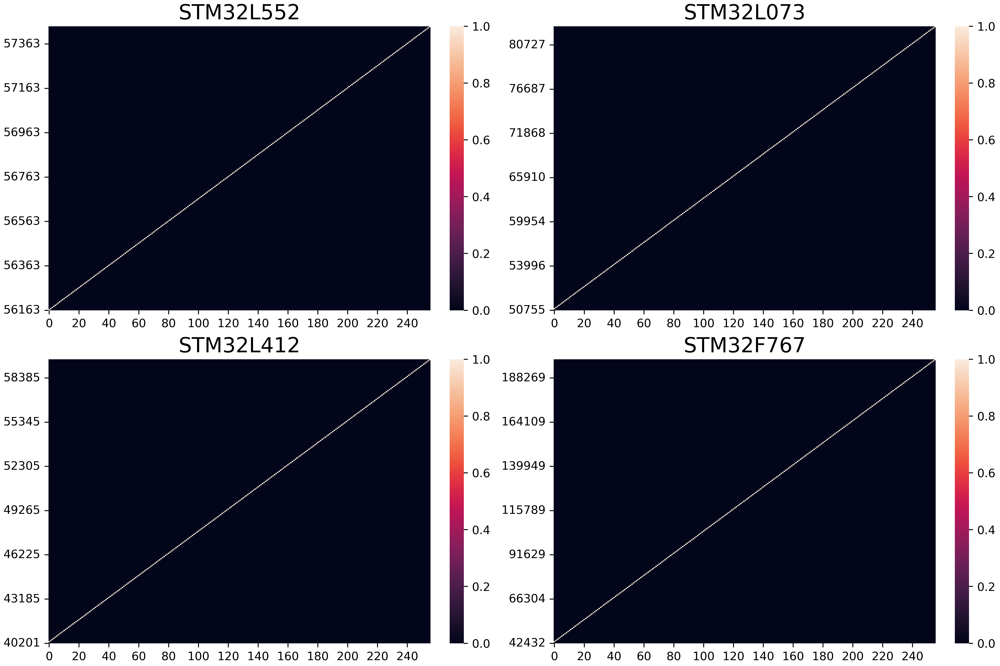
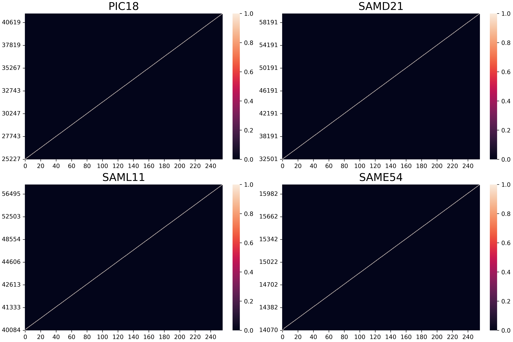
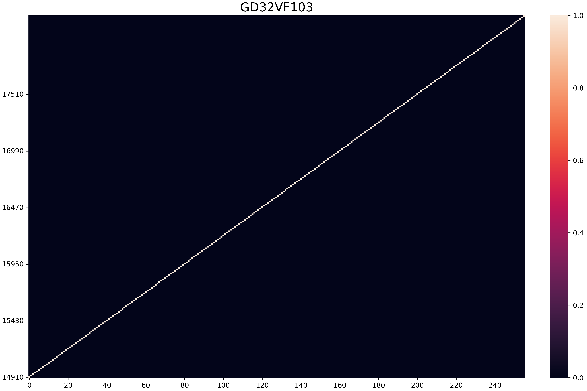

# DMA Covert Channels

## 1 - Samples
For each board, perform sampling of the channel with and without contention.

- Store samples with contention in `./BoardX/samples_cont.txt`.
- Store samples without contention in `./BoardX/samples_no_cont.txt`.

## 2 - Measure Channel

Use the `capacity.sh` script to measure the channel capacity for each board.

Usage: 
- `capacity.sh [boardx]`: Specify the target board by providing its name, e.g., `capacity.sh PIC18`.

The script will output the following files in the `./BoardX/Results` directory:
- `BoardX_Contention_samples.txt`: Covert-channel samples with contention;
- `BoardX_Contention_capacity.txt`: Channel capacity of the covert-channel samples with contention;
- `BoardX_No_Contention_samples.txt`: Covert-channel samples without contention (should not create a channel);
- `BoardX_No_Contention_capacity.txt`: Channel capacity of the covert-channel samples without contention (should not create a channel);
- `BoardX_Contention_ch_matrix.txt`: The channel matrix of the covert-channel samples with contention. This file is generated to be later be used by `heatmap.py` tool to plot the channel matrix. 

## 3 - Results 

| Platforms  | PIC18F16Q41 | GD32VF103 | STM32L0 | SAMD21 | EFM32GG | SAML11 | STM32L5 | LPC5500 | STM32f4 | SAME54 | STM32F7/H7 |
| ---------- |:-----------:|:---------:|:-------:|:------:|:-------:|:------:|:-------:|:-------:|:-------:|:------:|:----------:|
| Vendor     |     MC      |    GD     |   ST    |   MC   |   SL    |   MC   |   ST    |   NXP   |   ST    |   MC   |     ST     |
| MCU        |     P18     |    RVM    |   M0+   |  M0+   |   M3    |  M23   |   M33   |   M33   |   M4    |   M4   |     M7     |
| ISA        |     PIC     |   RV32    |   v6M   |  v6M   |   v7M   |  v8M   |   v8M   |   v8M   |   v7M   |  v7M   |    v7M     |
| Arch       |      H      |     H     |   VM    |   VM   |    H    |   VM   |    H    |    H    |    H    |   H    |     H      |
| Isolation  |      -      |    PMP    |   MPU   |   -    |   MPU   |   TZ   |   TZ    |   TZ    |   MPU   |  MPU   |    MPU     |
| Policy     |      P      |     R     |    R    |   P    |    R    |   PR   |    R    |    P    |    R    |   P    |     R      |
| **Ch. (bits)** |   ****6.16/8****    |  ****6.16/8****   | **6.16/8**  | **6.16/8** | **6.16/8**  | **6.16/8** | **6.16/8**  | **6.16/8**  | **6.16/8**  | **6.16/8** |   **6.16/8**   |

Evaluation of the extensibility of the vulnerability. Architectures: Von Neumann (VM) or Harvard (H). Vendors: ST, NXP, Silicon Labs (SL), Microchip (MC) and Gigadevice (GD). MCUs: Cortex-Mx (Mx), PIC18 (P18) and RISC-V Microcontroller Profile (RVM). ISAs: Armv6-M (v6M), Armv7-M & Armv7E-M (v7M), Armv8-M (v8M), PIC, and RISC-V RV32IMAC (RV32). Interconnect arbitration policy: Priority-based (P), Round-robin (R) and Priority-based or Round-robin (PR). MCUs with any hardware isolation primitive (–).

### NXP Channel Matrix

### STM Channel Matrix

### Microcip Channel Matrix

### Gigadevice Channel Matrix

### Silicon Labs Channel Matrix

